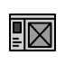

# Exercícios de Design - DIO.me  

Este repositório contém os projetos e desafios de design propostos pela plataforma DIO.me como parte do curso de Design UI/UX. O objetivo desses exercícios foi aplicar os conceitos aprendidos no curso e desenvolver habilidades práticas na criação de interfaces e sistemas de design.

---

## 📌 Desafios Realizados  

### 1. Criação de um Wireframe de Média Fidelidade  

Neste desafio, foi necessário criar um wireframe de média fidelidade, aplicando os conceitos e leis de design aprendidos durante o curso.  

**📂 Localização dos arquivos:**  
A pasta contendo as imagens referentes a este desafio, com todas as telas, está disponível [aqui](/pages/Wireframe-Media-Fidelidade/).  

**🔹 Descrição do projeto**  
O projeto consiste em uma **landing page versátil**, que pode ser adaptada para diferentes propósitos, como a apresentação de uma loja, um portfólio pessoal ou qualquer outro serviço. O objetivo foi criar um layout **simples, intuitivo e direto ao ponto**.  

### 📑 Estrutura das Páginas  

- **[Home](/pages/Wireframe-Media-Fidelidade/Home.jpg)**  
  Apresenta um banner principal (estático ou em carrossel) seguido de três seções informativas. Na parte superior, há uma barra de navegação com links para outras áreas do site e um espaço dedicado à logo.  

- **[Seção 1](/pages/Wireframe-Media-Fidelidade/Section_1.jpg)**  
  Uma seção com uma imagem à esquerda e um bloco de texto à direita, permitindo que o conteúdo seja apresentado de forma clara e organizada.  

- **[Seção 2](/pages/Wireframe-Media-Fidelidade/Section_2.jpg)**  
  Similar à Seção 1, mas com a ordem dos elementos invertida, garantindo um design dinâmico e evitando repetitividade.  

- **[Footer](/pages/Wireframe-Media-Fidelidade/Footer.jpg)**  
  Contém uma imagem de destaque e um rodapé com links para outras áreas do site, informações de contato e campos adicionais para descrições.  

---

### 2. Criação de um Design System Completo  

Neste desafio, foi necessário criar um **Design System do zero**, incorporando conceitos de **cores, tipografia, espaçamentos (micro e macro), componentes e ícones**, garantindo um sistema coeso e eficiente.  

**📂 Localização dos arquivos:**  
A pasta contendo as imagens referentes a este desafio, com todas as telas, está disponível [aqui](/pages/Design-System/).  

**🔹 Descrição do projeto**  
O objetivo do projeto foi criar um site onde os usuários podem gerar **documentos personalizados para seus pets**. O sistema permite a criação de um "RG" fictício para os animais, com um design divertido e personalizado. Embora não tenha caráter oficial, a proposta é proporcionar uma forma criativa e carinhosa de demonstrar o vínculo com os pets.  

### 📑 Estrutura das Páginas  

- **[Home](/pages/Desing%20System/Home.png)** → Apresenta os serviços e funcionalidades disponíveis no site.  
- **[Login](/pages/Desing%20System/Login.png)** → Permite que os usuários acessem suas contas.  
- **[Cadastro](/pages/Desing%20System/Cadastro.png)** → Coleta e armazena as informações dos usuários no banco de dados.  
- **[Doe](/pages/Desing%20System/Doe.png)** → Página destinada a doações via Pix para apoiar o projeto.  
- **[Exemplos](/pages/Desing%20System/Exemplos.png)** → Demonstra como será o RG dos pets após a finalização do processo.  
- **[Pets](/pages/Desing%20System/Pets.png)** → Lista todos os pets cadastrados pelo usuário.  

📌 **Observação:** O **Header** e **Footer** são fixos. Todas as mudanças de conteúdo ocorrem dentro da tag `<main>`.  

---

## 🚀 Tecnologias Utilizadas  

- **Figma** → Criação de wireframes, interfaces e protótipos interativos.  
- **Iconify (Plugin)** → Utilizado para adicionar ícones ao Design System.  

---